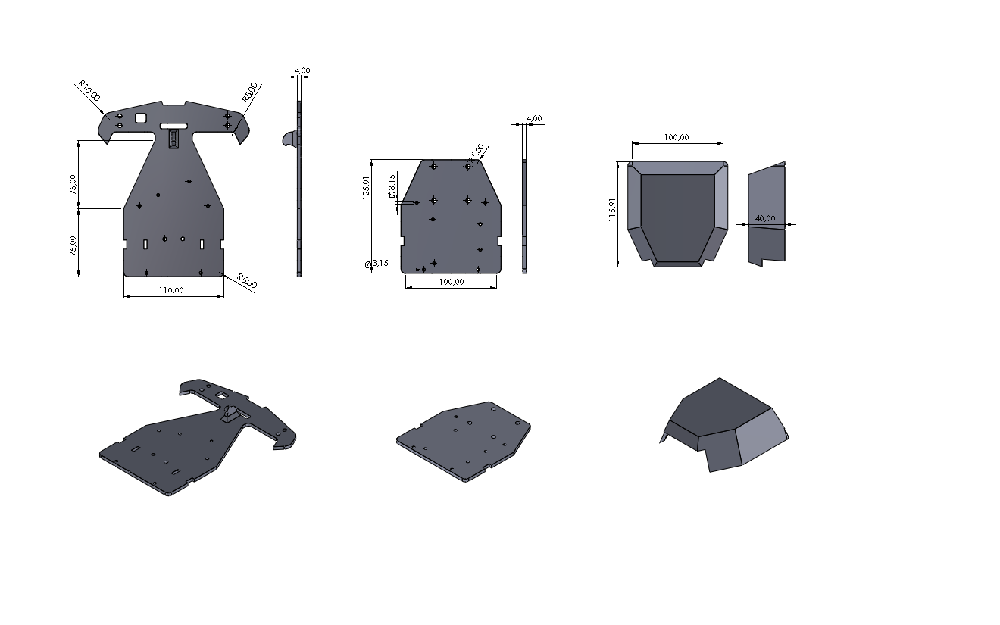

# Line Follower & Fire Extinguisher Robot

Proyek ini adalah kode Arduino untuk robot line follower yang juga dapat mendeteksi dan memadamkan api menggunakan sensor flame dan kipas. Robot menggunakan 5 sensor garis, motor driver dual channel, serta fitur CLP (tombol reset/manual) dan sensor api.

## Fitur Utama

- **Line Follower**: Menggunakan 5 sensor garis analog (A1–A5) dengan algoritma PID untuk mengikuti garis.
- **Pemadam Api**: Ketika semua sensor garis tidak mendeteksi garis, robot berhenti dan menyalakan kipas jika sensor api aktif.
- **CLP (Tombol Reset)**: Jika tombol CLP ditekan, robot akan mundur dan mencari garis kembali.
- **Manuver Tajam**: Robot dapat berbelok tajam ke kiri/kanan jika mendeteksi pola tertentu pada sensor garis.

## Pinout

| Fungsi            | Pin Arduino |
|-------------------|-------------|
| Motor Kiri ENA    | 9           |
| Motor Kiri IN1    | 2           |
| Motor Kiri IN2    | 3           |
| Motor Kanan ENB   | 10          |
| Motor Kanan IN3   | 4           |
| Motor Kanan IN4   | 5           |
| CLP (Tombol)      | 6           |
| Near (Sensor)     | 7           |
| Kipas (FAN)       | 11          |
| Flame Sensor      | 13          |
| Sensor Garis      | A1–A5       |

## Cara Kerja

1. **Line Following**  
   Robot membaca 5 sensor garis, menghitung posisi garis, dan mengatur kecepatan motor kiri/kanan menggunakan PID.

2. **Pemadaman Api**  
   Jika semua sensor garis tidak mendeteksi garis, robot berhenti dan menyalakan kipas jika sensor api aktif.

3. **CLP**  
   Jika tombol CLP ditekan, robot mundur dan mencari garis kembali.

4. **Manuver Tajam**  
   Jika pola tertentu terdeteksi pada sensor garis, robot melakukan belokan tajam ke kiri atau kanan.

## Struktur Kode

- `bacaSensor()`: Membaca sensor garis dan mengisi array `sensorValues`.
- `hitungPosisi()`: Menghitung posisi garis relatif terhadap robot.
- `kontrolPID()`: Mengatur kecepatan motor berdasarkan hasil PID.
- `motorGerak()`: Mengatur arah dan kecepatan motor.
- `berhenti()`, `kiriTajam()`, `kananTajam()`: Fungsi manuver.
- `aksiCLP()`: Aksi saat tombol CLP ditekan.
- `aksiKipas()`: Mengontrol kipas berdasarkan sensor api.

## Penggunaan

1. Upload kode ke Arduino.
2. Hubungkan semua sensor dan aktuator sesuai pinout.
3. Robot akan otomatis mengikuti garis dan memadamkan api jika terdeteksi.

---

**Catatan:**  
- Sesuaikan nilai PID (`Kp`, `Ki`, `Kd`) dan threshold sensor sesuai karakteristik robot dan sensor Anda.
- Pastikan wiring motor dan sensor sudah benar agar arah gerak sesuai.

---
